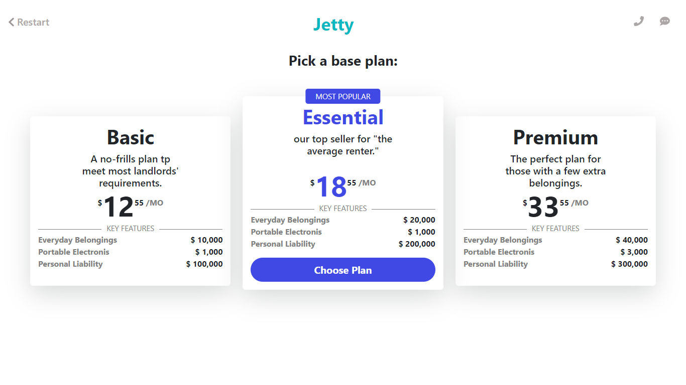
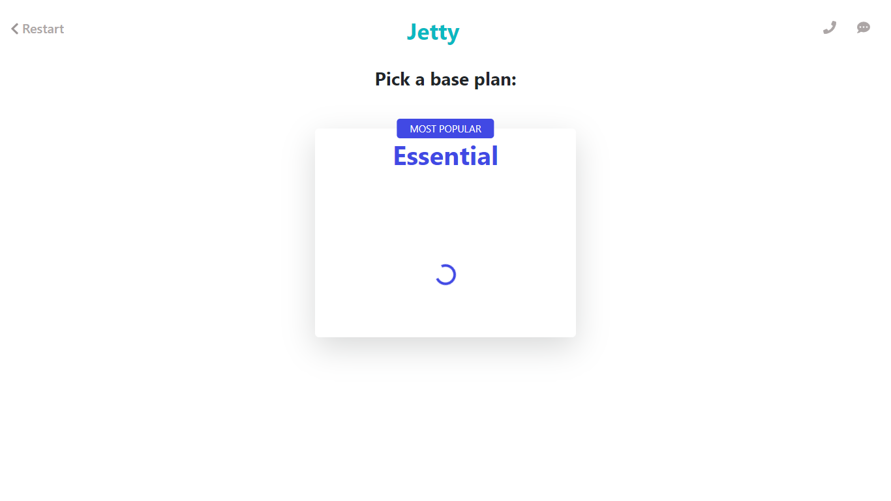
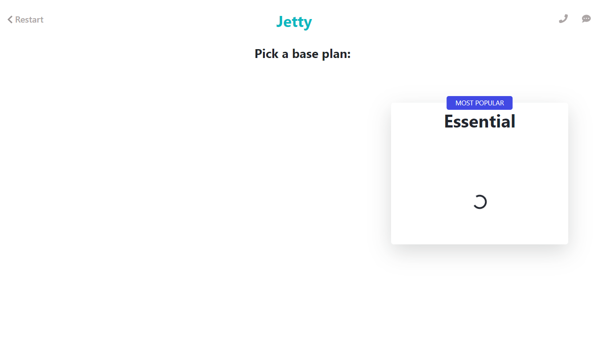
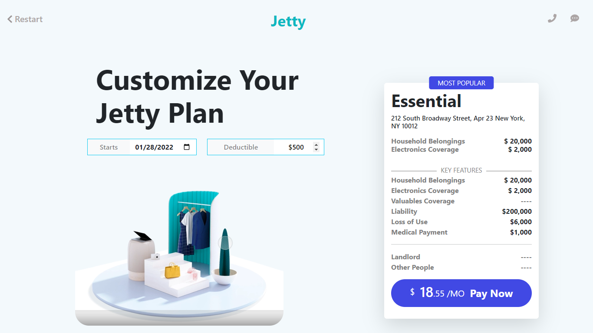

# A 3-tier Pricing page design
A 3-tier Pricing Page that Performs Slide animatons and renders additional info without reloading the page.

## Screenshots

  

  

  

  

## Technologies Used

- HTML, CSS, JavaScript for front-end
- Bootstrap framework for responsive design

## Contributions

Contributions are welcome! Open issues and submit pull requests for improvements or bug reports.
